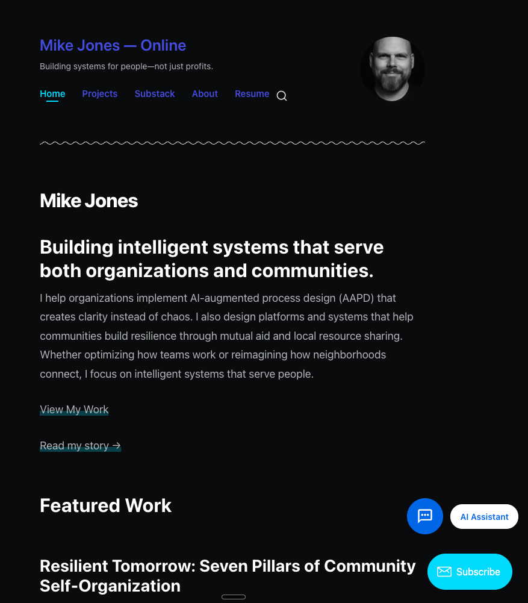
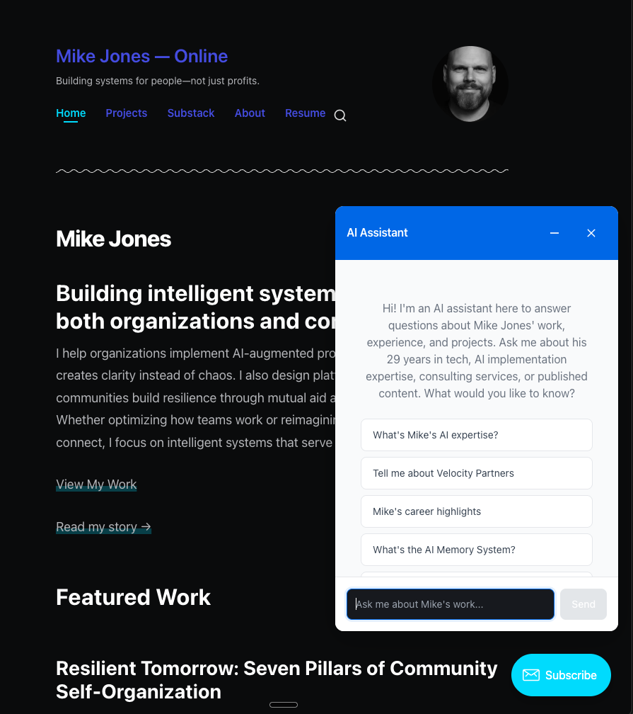
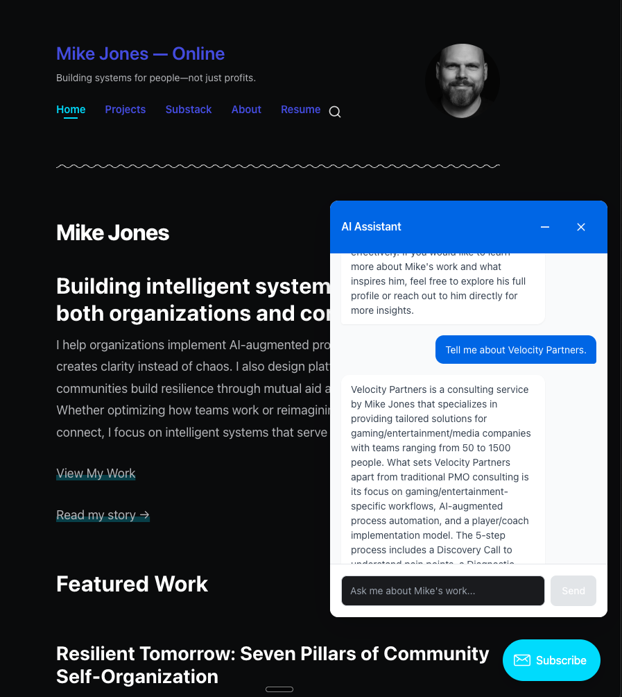
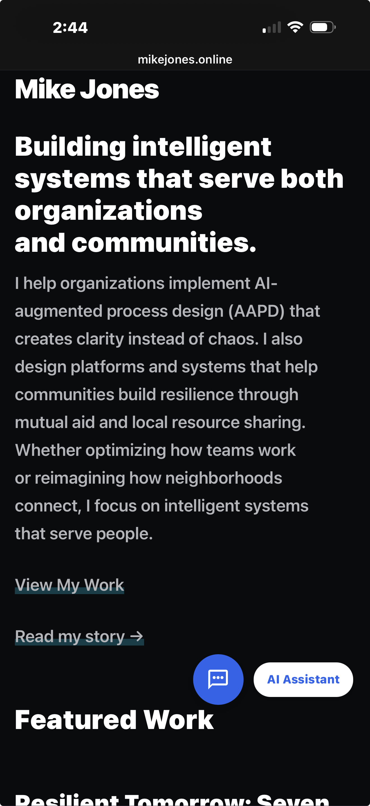
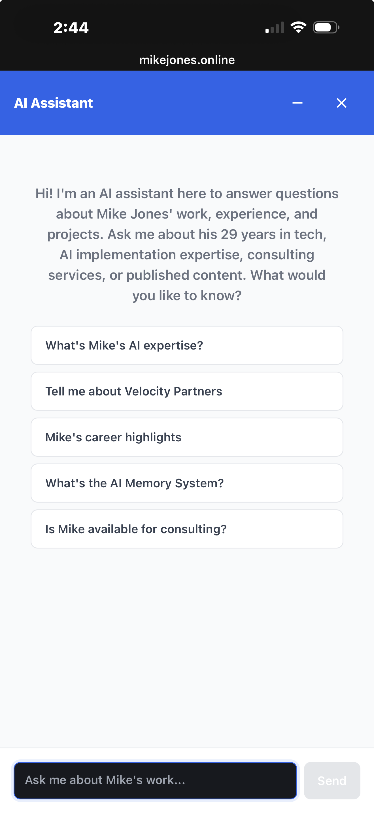

# Distill

Turn your career documents into an AI-powered chatbot that can answer questions about you and your career.

## What This Is

An open-source toolkit for building a personal knowledge chatbot — the kind you embed on your portfolio site so visitors can ask questions about your work, experience, and expertise. Instead of a static resume, you get an interactive AI that can hold a real conversation about who you are and what you've done.

The toolkit handles the full pipeline: parsing your documents into a structured knowledge base, deepening that knowledge through an AI-conducted interview, and deploying a chatbot that retrieves relevant knowledge and generates responses.

## How It Works

The pipeline has three stages:

**1. Document Parsing** — Feed your resume, project docs, blog posts, or any other source material to an AI. It extracts structured knowledge entries in JSONL format: facts, narratives, Q&A pairs, technical details, and fit assessments.

**2. Interview Deepening** — An AI interview bot conducts a structured conversation with you, asking follow-up questions based on your documents to extract the tacit knowledge that resumes can't capture — the war stories, decision-making processes, motivations, and context that make your chatbot sound like it actually knows you.

**3. Deploy** — A Cloudflare Worker backend handles retrieval and AI response generation. A vanilla JS widget (zero dependencies, ~15KB) embeds on any website. Drop in a script tag and you're live.

## What It Looks Like
*The widget sits unobtrusively on your site*
<br>

<br><br>

*Sample questions are provided to visitors to help get them started*
<br>

<br><br>


*Visitors ask questions and get answers grounded in your knowledge base*
<br>

<br><br>


*Configured to be mobile friendly*
<br>

<br><br>

*Approachable interface on mobile*
<br>

<br><br>


## Project Structure

```
├── docs/
│   ├── SCHEMA.md              # JSONL knowledge base format specification
│   ├── QUICKSTART.md          # Step-by-step setup guide
├── templates/
│   ├── backend/               # Cloudflare Worker backend template
│   │   ├── src/               # Worker source (router, retrieval, AI integration)
│   │   └── test/              # Test suite (77 tests, zero dependencies)
│   ├── frontend/              # Embeddable chat widget template
│   └── interview-bot/         # Interview bot prompts and framework
├── examples/
│   └── example-knowledge.jsonl # 18-entry sample knowledge base
├── scripts/
│   └── validate.js            # Knowledge base validation tool
├── CONTRIBUTING.md            # How to contribute
└── LICENSE                    # MIT License
```

## Quick Start

1. Gather your source documents (resume, project docs, portfolio content)
2. Use the document parsing prompts to create your initial JSONL knowledge base
3. Run the interview bot to deepen your knowledge base with narratives and context
4. Configure the backend template with your API key (OpenAI or Anthropic)
5. Deploy to Cloudflare Workers
6. Add the widget script tag to your website

See [docs/QUICKSTART.md](docs/QUICKSTART.md) for the detailed setup guide.

## The Knowledge Base

The core of the system is a `.jsonl` file — one JSON object per line, each representing a piece of knowledge about you. Five entry types cover different kinds of information:

- **fact** — Atomic, verifiable statements ("Jane has 15 years of experience in distributed systems")
- **narrative** — Contextual stories ("How we migrated 50 services to Kubernetes...")
- **qa_pair** — Pre-formatted Q&A ("What services does Jane offer?" → answer)
- **technical** — Architecture and implementation details
- **fit_assessment** — Who you work best with (and who you don't)

See [docs/SCHEMA.md](docs/SCHEMA.md) for the complete format specification.

## Architecture

```
Visitor asks a question
        │
        ▼
┌─────────────────────┐
│  Embeddable Widget   │  Vanilla JS, zero dependencies
│  (your website)      │  ~15KB, WCAG 2.1 AA accessible
└─────────┬───────────┘
          │ POST /chat
          ▼
┌─────────────────────┐
│  Cloudflare Worker   │  Serverless backend
│                      │
│  1. Rate limiting    │  Session + IP based
│  2. RAG retrieval    │  Keyword scoring, top 5 entries
│  3. AI generation    │  OpenAI or Anthropic (your choice)
│  4. Response         │  Grounded in your knowledge base
└─────────────────────┘
```

**Cost:** Under $10/month for typical personal use (500-2,500 conversations).

## Origin Story

This toolkit started as a personal project — a chatbot for [MikeJones.online](https://mikejones.online) that answers visitor questions using a 190-entry knowledge base about Mike's career, projects, and expertise. The knowledge base was built in two phases: AI-parsed career documents, then a structured interview process that extracted the deeper context and stories that documents alone can't capture.

The interview bot insight — that the hardest part isn't the code, it's creating a high-quality knowledge base, and that structured interviews solve this — is what makes this toolkit worth sharing.

## Status

This project is in active development. Current focus is on extracting and generalizing the core pipeline into reusable templates. Contributions and feedback welcome.

## License

[MIT](LICENSE) — do whatever you want with it.
